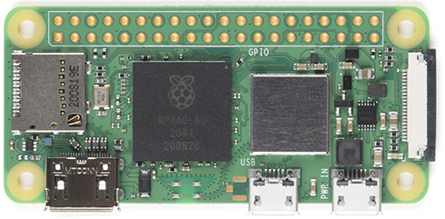
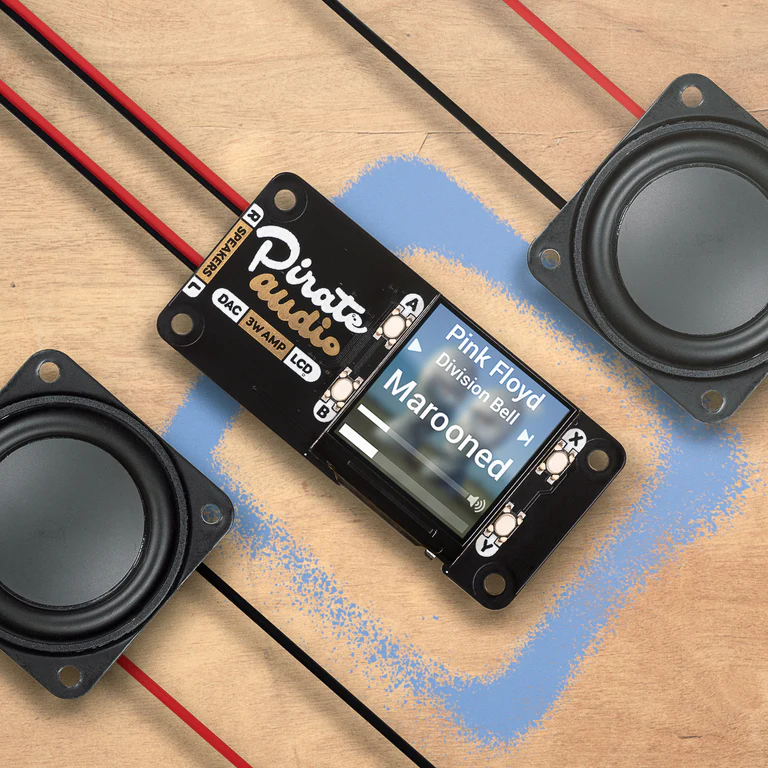
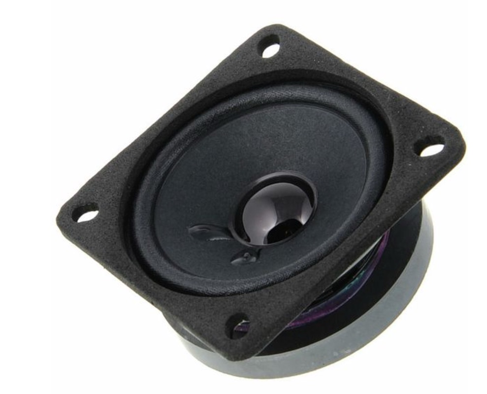
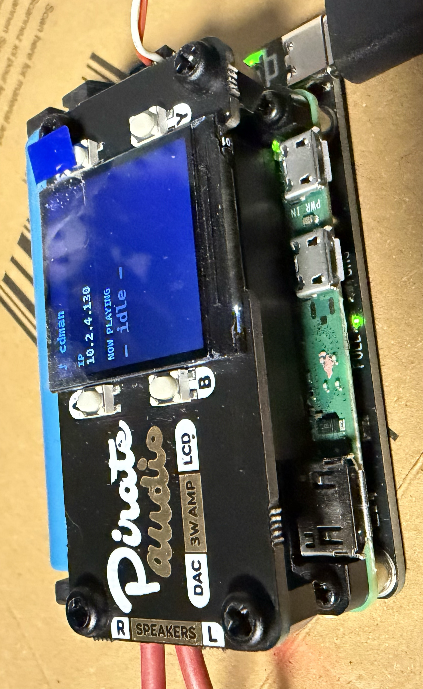

# Raspberry Retro Game Player

Raspberry Pi buzzer like player, inspired by hibit-dev/buzzer arduino project, to play old retro game mellodies with RPi and little DAC+AMP+Speaker. 

I really enjoyed playing with hibit-dev/buzzer specially when I created tones for Karateka 1984 by Jordan Mechner, so I wanted to play more, but Arduino felt very limited with no quolity of life extras like Online Editor. You need to change code, upload it and then check result, that was really slow for me. 

So I decided to go with Raspberry Pi 2 Zero + Dac/AMP + Speaker - this way I had more room for improvements, WEB server which I can access remotely, and use with it Online Editor/Player. Project was fully created by Claude.AI in few hours of vibe coding. 

What you need: 

1. Raspberry Pi with WiFi/LAN port - no matter which one, I used Raspberry Pi Zero 2 W (https://www.raspberrypi.com/products/raspberry-pi-zero-2-w/)

2. Some Dac + AMP - I used Pirate Audio: 3W Stereo Amp for Raspberry Pi (https://shop.pimoroni.com/products/pirate-audio-3w-stereo-amp) , I used MONO switch and then only 1 speaker

3. Single speaker 3W / 8ohm , I used Visaton FRS 7-8 Ohm because I had it. 

And here is the final result - with some heatsink + battery power ( optional )

Note: You can use any other DAC/AMP compbination - I just had these laying arround. 

Since Pirate Audio: 3W Stereo Amp had screen, I used that one to print IP address from DHCP , so it was easy to access it via web browser at http://my_ip_addr:8080

There is an option to play on browser or on device. Interface is pretty cool and easy to work with, and it allows you to compose on the screen, import from Arduino format, and play directly to check the result. There is option to change volume and tempo, and even Piano Roll menu.